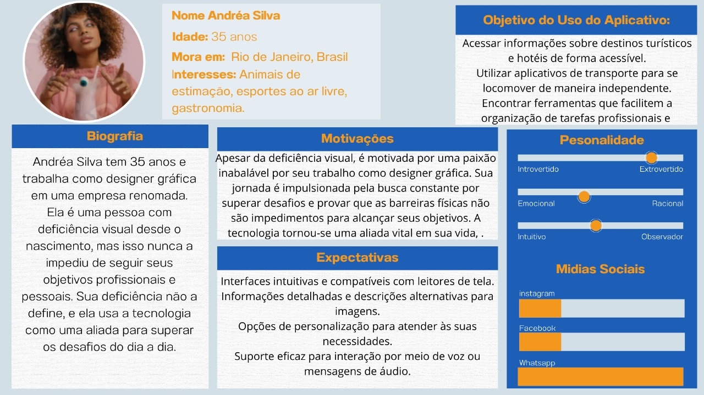
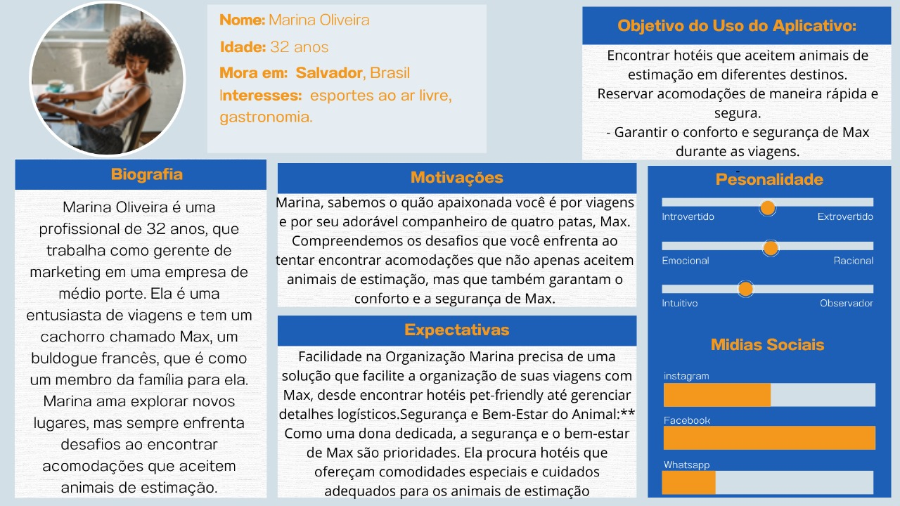
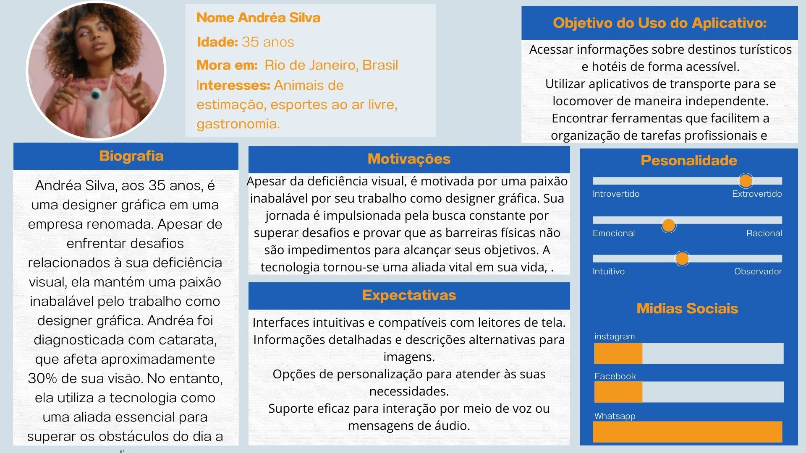
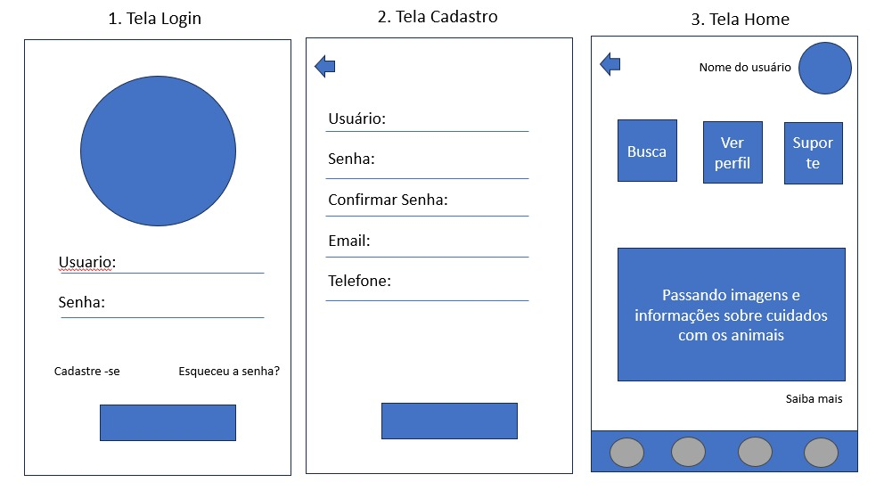
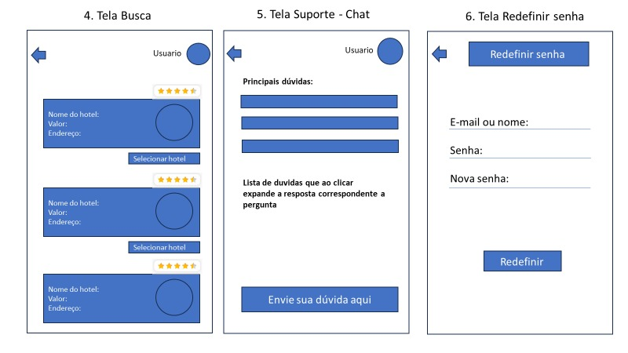
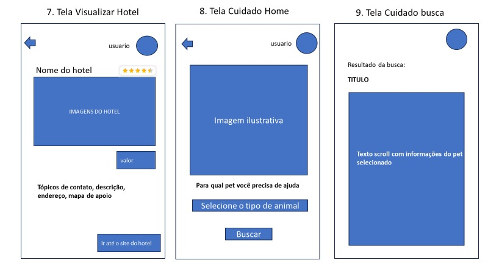
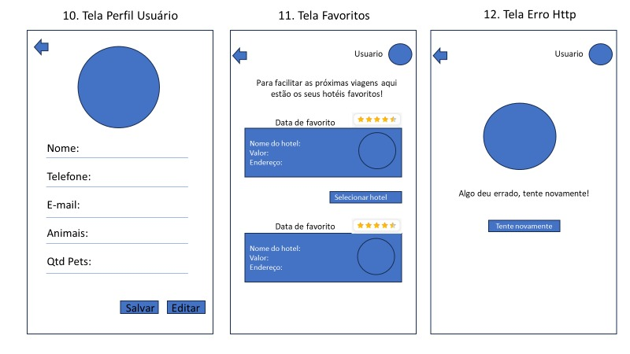

# FeriasPet

# Sobre o Projeto
Nos dias atuais tendo em vista um crescimento exponencial de pessoas adquirindo ou adotando novos Pets, 
viemos trazer a melhor solução para quem não gosta de se ausentar de seu pequeno companheiro, mas mesmo
assim adora viajar pelo mundo! pra essas pessoas criamos o Férias Pet! um aplicativo voltado única e 
exclusivamente para quem ama viajar e ama também os animais! 

Temos como principal objetivo funcionar como um buscador de hotéis para destino de viagem do usuário, 
onde encontrará uma listagem de hotéis que aceitem Pet, além de auxiliar com dicas para o 
transporte e estadia com melhor qualidade e segurança para o Pet. Havendo também, a possibilidade de avaliar, entrar 
em contato e favoritar os hotéis pesquisados.
  

# Características do Projeto
FeriasPet será um aplicativo que irá auxiliar com a busca de hoteis para se acomodar com os pets. Um aplicativo para hotéis de
pets desempenha um papel fundamental na modernização e eficiência da gestão de tais estabelecimentos. 
Em resumo, um aplicativo para hotéis de pets é uma ferramenta poderosa que aprimora a experiência tanto 
para os donos de pets quanto para os estabelecimentos de hospedagem de animais. Facilita a gestão, melhora a comunicação e 	 
proporciona um nível mais alto de cuidado e segurança para os animais de estimação, tornando-se essencial para 
o sucesso e a eficiência desses negócios. 	

# Índice/Sumário

* [Sobre](#sobre-o-projeto)
* [Características do Projeto](#Características-do-Projeto)
* [Requisitos Funcionais](#requisitos-funcionais)
* [Requisitos Não Funcionais](#Requisitos-Não-Funcionais)
* [Personas](#personas)
* [Cenários](#cenarios)
* [Autores](#autores)
* [Protótipos](#prototipos)
* [Protótipo Real - Extra](#prototipo-real-extra)
* [Avaliação Heurística de Nielson e SUS](#Avaliação-Heurística-de-Nielson-e-SUS)
* [Licença](#licença)
* [Agradecimentos](#agradecimentos)
* [Considerações Finais](#consideracoes)

# Requisitos Funcionais 
Requisitos funcionais são as características ou funcionalidades que um sistema deve ter para atender às necessidades 
do usuário. Eles descrevem o que o sistema deve fazer, em termos de tarefas e serviços.

Abaixo será listado os RFs do projeto:

<ul>
	<li>
		<strong>RN001</strong>
		  
Origem: Usuário;

		  
Nome: Tela de login;

		  
Descrição: O sistema deve receber E-mail/CPF e senha para acessar o sistema.

		  
Prioridade: Muito Alta;

	</li>
	&nbsp;
	<li>
		<strong>RN002</strong>
		  
Origem: Usuário;

		  
Nome: Cadastro;

		  
Descrição: O sistema deve cadastrar usuário (administrador/dependente), salvando no banco de dados.

		  
Prioridade: Muito Alta;

	</li>
	&nbsp;
	<li>
		<strong>RN003</strong>
		  
Origem: Usuário;

		  
Nome: Editar perfil;

		  
Descrição: O sistema deve permitir que o usuário edite o seu perfil, podendo alterar a senha e sair da conta.

		  
Prioridade: Muito Alta;

	</li>
	&nbsp;
	<li>
		<strong>RN004</strong>
		  
Origem: Sistema;

		  
Nome: CRUD Hoteis;

		  
Descrição: O sistema deve permitir que o usuário com perfil de administrador possa adicionar, remover, editar e consultar um novo hotel.

		  
Prioridade: Muito Alta;

	</li>
	&nbsp;
	<li>
		<strong>RN005</strong>
		  
Origem: Sistema;

		  
Nome: Tela inicial;

		  
Descrição: O sistema deve possuir uma pagina inicial que seja possivel redirecionar para as telas de busca, suporte para o cliente e cuidados com pet.

		  
Prioridade: Muito Alta;

	</li>
	&nbsp;
	<li>
		<strong>RN006</strong>
		  
Origem: Sistema;

		  
Nome: Tela de busca;

		  
Descrição: O sistema deve possuir uma pagina de busca que nela será possivel mostrar uma listagem de hoteis, assim como, filtro baseado em valores e mais 
			  recomendados.

		  
Prioridade: Muito Alta;

	</li>
	&nbsp;
	<li>
		<strong>RN007</strong>
		  
Origem: Sistema;

		  
Nome: Tela de busca selecionada;

		  
Descrição: O sistema deve possuir uma pagina que irá trazer os dados do hotel selecionado, além de ter uma sessão para comentarios e favoritar a busca

		  
Prioridade: Muito Alta;

	</li>
	&nbsp;
	<li>
		<strong>RN008</strong>
		  
Origem: Sistema;

		  
Nome: Tela de cuidados com pet;

		  
Descrição: O sistema deve possuir uma pagina que será uma tela que irá dar dicas sobre a categoria do pet selecionado;

		  
Prioridade: Muito Alta;

	</li>
	&nbsp;
	<li>
		<strong>RN009</strong>
		  
Origem: Sistema;

		  
Nome: Tela de suporte;

		  
Descrição: O sistema deve possuir uma pagina que será uma tela com dúvidas e respostas frequentes sobre o app e as funcionalidades;

		  
Prioridade: Muito Alta;

	</li>
	&nbsp;
	<li>
		<strong>RN010</strong>
		  
Origem: Sistema;

		  
Nome: Tela de favoritos;

		  
Descrição: O sistema deve possuir uma pagina que será uma tela com a listagem de buscas favoritadas, os itens deverão ser apresentados 
			  	pela ordem de mais recente
		  

		  
Prioridade: Muito Alta;

	</li>
	&nbsp;
	<li>
		<strong>RN011</strong>
		  
Origem: Sistema;

		  
Nome: Barra de navegação;

		  
Descrição: O sistema deve possuir uma navegação na parte inferior da tela, redirecionando para a pagina inicial, pagina de busca, favoritos e suporte
		  

		  
Prioridade: Muito Alta;

	</li>
	&nbsp;
	<li>
		<strong>RN012</strong>
		  
Origem: Sistema;

		  
Nome: Icone perfil Menu;

		  
Descrição: O sistema deve possuir um icone de menu que irá conceder acesso ao perfil do usuário, se ele for administrador, dar acesso para adicionar, editar e excluir 				hoteis da api
		  

		  
Prioridade: Muito Alta;

	</li>
</ul>

# Requisitos Não Funcionais 
Requisitos não funcionais (RNFs) são as restrições impostas a um sistema que definem seus atributos de qualidade. Os RNFs 
são importantes porque eles determinam como o sistema irá se comportar e atender às expectativas dos usuários ou dos stakeholders.

Abaixo será listado os RNFs do projeto:

<ul>
	<li>
		<strong>RNF001</strong>
		  
Origem: API;

		  
Nome: Login dos usuários;

		  
Descrição: Permitir login apenas de usuários cadastrados;

		  
Prioridade: Muito Alta;

	</li>
	&nbsp;
	<li>
		<strong>RNF002</strong>
		  
Origem: API;

		  
Nome: Cadastro de usuários;

		  
Descrição: Permitir que o usuário crie 
				uma conta, e checar se já 
				tem um usuário com o 
				mesmo apelido antes de 
				cadastrar;
		  

		  
Prioridade: Muito Alta;

	</li>
	&nbsp;
	<li>
		<strong>RNF003</strong>
		  
Origem: Mobile;

		  
Nome: Executável plataformas Android e IOS;

		  
Descrição: O aplicativo deve ser 
				desenvolvido para rodar 
				em plataformas 
				Android/IOS;
		  

		  
Prioridade: Muito Alta;

	</li>
	&nbsp;
	<li>
		<strong>RNF004</strong>
		  
Origem: Framework;

		  
Nome: Utilizar React Native com expo ou Flutter/Dart;

		  
Descrição: Utilizar o framework para criar a aplicação mobile;

		  
Prioridade: Muito Alta;

	</li>
	&nbsp;
	<li>
		<strong>RNF005</strong>
		  
Origem: Mobile;

		  
Nome: Validar internet;

		  
Descrição: Permitir o modo
    				multiplayer somente se o 
				usuário estiver conectado 
				a uma rede de internet;
		  

		  
Prioridade: Muito Alta;
  
	</li>
	&nbsp;
	<li>
		<strong>RNF006</strong>
		  
Origem: Mobile;

		  
Nome: Usabilidade;

		  
Descrição: O sistema deve ser fácil de aprender e usar;

		  
Prioridade: Muito Alta;
  
	</li>
	&nbsp;
	<li>
		<strong>RNF007</strong>
		  
Origem: Aplicação;

		  
Nome: Segurança;

		  
Descrição: O sistema deve proteger os dados dos usuários contra acesso não autorizado;

		  
Prioridade: Muito Alta;

	</li>
 	&nbsp;
	<li>
		<strong>RN008</strong>
		  
Origem: Sistema;

		  
Nome: Mecanismo para busca;

		  
Descrição: O sistema deve realizar a busca de hoteis usando serviço do google 

		  
Prioridade: Muito Alta;

	</li>
	&nbsp;
	<li>
		<strong>RN009</strong>
		  
Origem: Sistema;

		  
Nome: Mecanismo para busca selecionada;

		  
Descrição: O sistema deve realizar a busca selecionada de hoteis usando serviço do google, trazendo informações necessárias para popular os campos da tela 

		  
Prioridade: Muito Alta;

	</li>
	&nbsp;
	
</ul>

# Personas

Personas são representações semifictícias de usuários-alvo, baseadas em dados reais sobre comportamento e características demográficas. Elas são usadas no design centrado no usuário para ajudar a garantir que os produtos e serviços sejam projetados para atender às necessidades e expectativas dos usuários.

As personas são criadas a partir de uma combinação de fontes de dados, incluindo pesquisas com usuários, análise de dados demográficos e psicográficos, e entrevistas com stakeholders. Abaixo será apresentado as personas que desenvolvemos para o projeto:

Persona 1:
   

      
   

Persona 2:
   

      
   

Persona 3:
   

      
   

Persona 4:
   

      
   

# Cenários

Cenários de usabilidade são histórias que descrevem como um usuário pode interagir com um produto ou serviço. Eles são usados para avaliar a usabilidade de um produto ou serviço, identificando possíveis problemas ou pontos de melhoria.

Cenários de usabilidade são uma ferramenta valiosa para o design centrado no usuário. Eles podem ajudar a garantir que os produtos e serviços sejam projetados para atender às necessidades e expectativas dos usuários. Abaixo será apresentado o cenário que desenvolvemos para o projeto:

Marina Oliveira

	Estar precisando de um hotel que aceite seu buldogue Max, ela ainda não sabe o destino, porque o destino depende dos hotéis pet friendly
	1.	Marina buscar no google por hotéis que aceitam pet 
	2.	Nas buscas aparece o “Férias pet”
	3.	Ela clica e aparece o site que de primeira ela já se interessa e sente confiança, pois as cores azuis e laranja transmitem essa mensagem de confiança e ser amigável.
	4.	Clica em criar uma conta por ser a primeira vez que acessa o site
	5.	Insere todos os dados e cria a conta 
	6.	Faz o login e vai em buscar 
	7.	Busca por hotéis em vários lugares 
	8.	Encontra um hotel que aceita e tem um veterinário ao lado. Além de ter 5 estrelas
	9.	Então segue para iniciar a reserva no site do hotel.

Bruna Alves

	Estar precisando de um hotel que aceite seus dois pets, ela quer viajar para chapada diamantina, já entende muito bem como funciona viajar com os animais. Mas será a primeira vez utilizando o “Férias pet”
	1.	Carla encontrou o “férias pet” através de um anuncio do Instagram 
	2.	Ela clica e aparece o site que de primeira ela também já se interessa e sente confiança.
	3.	Clica em criar uma conta por ser a primeira vez que acessa o site
	4.	Insere todos os dados e cria a conta 
	5.	Faz o login e vai em buscar 
	6.	Busca por hotéis selecionando o filtro da chapada diamantina 
	7.	Encontra um hotel que aceita
	8.	Então segue para iniciar a reserva no site do hotel.

Andrea Silva

	Estar precisando de um hotel que aceite seu pet, ela nunca viajou com ele e precisa não só encontrar um hotel, mas também encontrar ajuda para saber o que fazer.
	1.	Andrea encontrou o “férias pet” através de um anuncio do Instagram 
	2.	Ela clica e aparece o site que de primeira ela também já se interessa e sente confiança.
	3.	Clica em criar uma conta por ser a primeira vez que acessa o site
	4.	Insere todos os dados e cria a conta 
	5.	-Faz o login e vai em suporte
	6.	Seleciona o tipo de animal e consegue todas as dicas e ajudas para sua viagem 
	7.	Logo após busca por hotéis selecionando o filtro do no seu destino 
	8.	Encontra um hotel que aceita e que seja perto de um parque porque precisa passear
	9.	Então segue para iniciar a reserva no site do hotel.

# Autores

 
	<a href="https://github.com/Anndrei87" style="text-decoration: none;">
		
		 
	</a> 
 	 Feito por Andrei Moreira 👋!  

&nbsp;
&nbsp;

 
	<a href="https://github.com/GiovaniCitolin" style="text-decoration: none;">
		
		 
	</a> 
	 Feito por Giovani Citolin 👋!  

&nbsp;
&nbsp;

 
	<a href="https://github.com/Rox351" style="text-decoration: none;">
		
		 
	</a> 
	 Feito por Leonardo Soares 👋!  

&nbsp;
&nbsp;

 
	<a href="https://github.com/EduardoRuas1" style="text-decoration: none;">
		
		 
	</a> 
	 Feito por Eduardo Ruas 👋!  

&nbsp;
&nbsp;

 
	<a href="https://github.com/Dev-Gabriel-0" style="text-decoration: none;">
		
		 
	</a> 
	 Feito por Gabriel Alves 👋!  

&nbsp;
&nbsp;

 
	<a href="https://github.com/DannVSi" style="text-decoration: none;">
		
		 
	</a> 
	 Feito por Daniel Souza 👋!  

&nbsp;

 
	<a href="https://github.com/Azaff" style="text-decoration: none;">
		
		 
	</a> 
	 Feito por Leonardo Ferreira 👋!  

&nbsp;
&nbsp;
&nbsp;
&nbsp;

 
	<a href="https://github.com/mariadev2" style="text-decoration: none;">
		
		 
	</a> 
	 Feito por Maria Eduarda 👋!  

# Protótipos
Protótipo Low Fi - Wireframe estático

   &nbsp;&nbsp;Abaixo será apresentado frames que irá conter as telas low-fi da aplicação:
   
   Frame 1 com telas de login, cadastro e homepage
   

      
   

   
   Frame 2 com telas de busca, suporte e redefinir senha
   

      
   

  
   Frame 3 com telas de visualizar hotel, cuidado home e cuidado resultado busca
   

      
   

 
   Frame 4 com telas de visualizar perfil usuário, favoritos e erros https genéricos
   

      
   

   &nbsp;
   
Protótipo High Fi - Protótipo Interativo

   &nbsp;&nbsp;Abaixo será apresentado frames que irá conter as telas high-fi da aplicação:
   
   Frame 1 com telas de login, consultar perfil e homepage

   

      
      
      
   

   
   Frame 2 com telas de busca, busca selecionada perfil e cadastro
   
   

      
      
      
   

   Frame 3 com telas de recuperar senha, suporte home e suporte busca

   

      
      
      
   

   Frame 4 com telas de favoritos, erro generico http e label de erro para os formulários
   
   

      
      
      
   

# Protótipo Real - Extra
Para o protótipo real da aplicação, usamos Flutter, um framework do google que usa Dart para criar aplicações multiplataformas. Adicionamos um link de um video que mostra a navegação do app.
E o código se encontra na raiz desse projeto.

# Avaliação Heurística de Nielsen e SUS

Para acessar o relatório de Nielsen, você deverá acessar esse link: https://github.com/Anndrei87/FeriasPet/blob/main/assets/relatorio-nielsen/A3%20Nielsen.pdf

O link acima é um pdf que está localizado na pasta assets na raiz do projeto.

O relatório SUS, fizemos um html com uma tabela onde é possivel o usuário interagir dando notas e calculando a media. O html foi hospedado no github pages, um serviço
gratuito de hospedagem do github. 

Link do relatório SUS: https://anndrei87.github.io/FeriasPet/SUS/principal.html

# Licença

Este projeto está licenciado sob a Licença MIT,  consulte o arquivo [LICENSE.md](LICENSE.md) para mais detalhes.

# Agradecimentos

Este projeto foi um desafio e uma oportunidade de aprendizado. Aprendemos muito sobre o tema escolhido e sobre o processo de desenvolvimento de um projeto.
Agradeçemos por todos os envolvidos de equipe pelo trabalho árduo e dedicação. Juntos, conseguimos superar os desafios e entregar um projeto de alta qualidade
Agradeçemos também aos nossos professores pela orientação e apoio. Eles nos ajudaram a desenvolver nossas habilidades e a alcançar nossos objetivos.

A conclusão deste projeto é um marco importante na vida acadêmica dos integrantes da equipe. Estamos orgulhosos do trabalho que realizamos e estamos confiante de que este aprendizado será valioso para a nossa carreira profissional.

# Considerações Finais

Tendo em vista que o objetivo do projeto é facilitar e auxiliar em pesquisas referente a hotéis com estadia de animais de estimação, concluímos que a implementação do projeto facilitaria bem como auxiliaria qualquer dono de Pet a localizar tais hotéis, tão como receber dicas de como se portar com seu animal de estimação durante a viagem, tornando tal viagem mais segura e organizada tanto para o usuário tão como para seu animal de estimação; Além de ofertar a opção de favoritar e avaliar tais hotéis, facilitando e auxiliando a localização dos mesmos em uma próxima viagem.

O desenvolvimento desse projeto foi bastante satisfatório para a equipe, pois, foi possível para nós, estudar coisas novas, aprender sobre ferramentas e tecnologias novas e entender como funciona a criação de aplicativo desde o design até o produto final.
