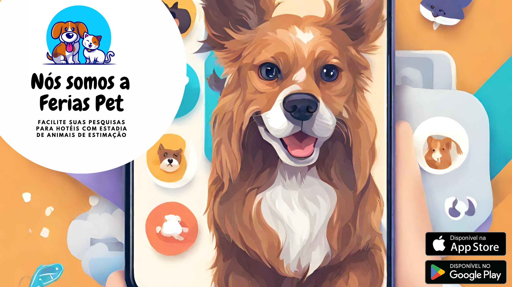

# FeriasPet

# Sobre o Projeto
Nos dias atuais tendo em vista um crescimento exponencial de pessoas adquirindo ou adotando novos Pets, 
viemos trazer a melhor solução para quem não gosta de se ausentar de seu pequeno companheiro, mas mesmo
assim adora viajar pelo mundo! pra essas pessoas criamos o Férias Pet! um aplicativo voltado única e 
exclusivamente para quem ama viajar e ama também os animais! 

Temos como principal objetivo funcionar como um buscador de hotéis para destino de viagem do usuário, 
onde encontrará uma listagem de hotéis que aceitem Pet, além de auxiliar com dicas para o 
transporte e estadia com melhor qualidade e segurança para o Pet. Havendo também, a possibilidade de avaliar, entrar 
em contato e favoritar os hotéis pesquisados.
  

# Características do Projeto
FeriasPet será um aplicativo que irá auxiliar com a busca de hoteis para se acomodar com os pets. Um aplicativo para hotéis de
pets desempenha um papel fundamental na modernização e eficiência da gestão de tais estabelecimentos. 
Em resumo, um aplicativo para hotéis de pets é uma ferramenta poderosa que aprimora a experiência tanto 
para os donos de pets quanto para os estabelecimentos de hospedagem de animais. Facilita a gestão, melhora a comunicação e 	 
proporciona um nível mais alto de cuidado e segurança para os animais de estimação, tornando-se essencial para 
o sucesso e a eficiência desses negócios. 	

# Índice/Sumário

* [Sobre](#sobre-o-projeto)
* [Características do Projeto](#Características-do-Projeto)
* [Requisitos Funcionais](#requisitos-funcionais)
* [Requisitos Não Funcionais](#Requisitos-Não-Funcionais)
* [Personas](#personas)
* [Cenários](#cenarios)
* [Autores](#autores)
* [Protótipos](#prototipos)
* [Avaliação Heurística de Nielson e SUS](#Avaliação-Heurística-de-Nielson-e-SUS)
* [Licença](#licença)
* [Agradecimentos](#agradecimentos)
* [Considerações Finais](#consideracoes)

# Requisitos Funcionais 

🚧  Em desenvolvimento . . .

# Requisitos Não Funcionais 

🚧  Em desenvolvimento . . .

# Personas

🚧  Em desenvolvimento . . .

# Cenários

🚧  Em desenvolvimento . . .

# Autores

# Protótipos
	- High-fi
 	- Low-fi

🚧  Ambos em desenvolvimento . . .

# Avaliação Heurística de Nielson e SUS

🚧  Em desenvolvimento . . .

# Licença

Este projeto está licenciado sob a Licença MIT,  consulte o arquivo [LICENSE.md](LICENSE.md) para mais detalhes.

# Agradecimentos

🚧  Em desenvolvimento . . .

# Considerações Finais

Tendo em vista que o objetivo do projeto é facilitar e auxiliar em pesquisas referente a hotéis com estadia de animais de estimação, concluímos que a implementação do projeto facilitaria bem como auxiliaria qualquer dono de Pet a localizar tais hotéis, tão como receber dicas de como se portar com seu animal de estimação durante a viagem, tornando tal viagem mais segura e organizada tanto para o usuário tão como para seu animal de estimação; Além de ofertar a opção de favoritar e avaliar tais hotéis, facilitando e auxiliando a localização dos mesmos em uma próxima viagem.

O desenvolvimento desse projeto foi bastante satisfatório para a equipe, pois, foi possível para nós, estudar coisas novas, aprender sobre ferramentas e tecnologias novas e entender como funciona a criação de aplicativo desde o design até o produto final.
